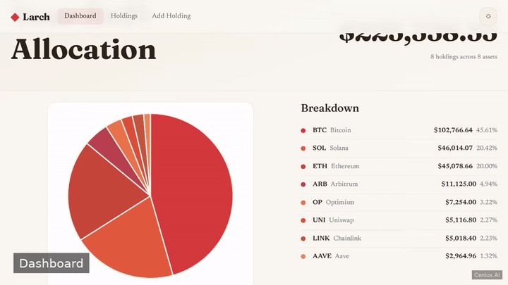
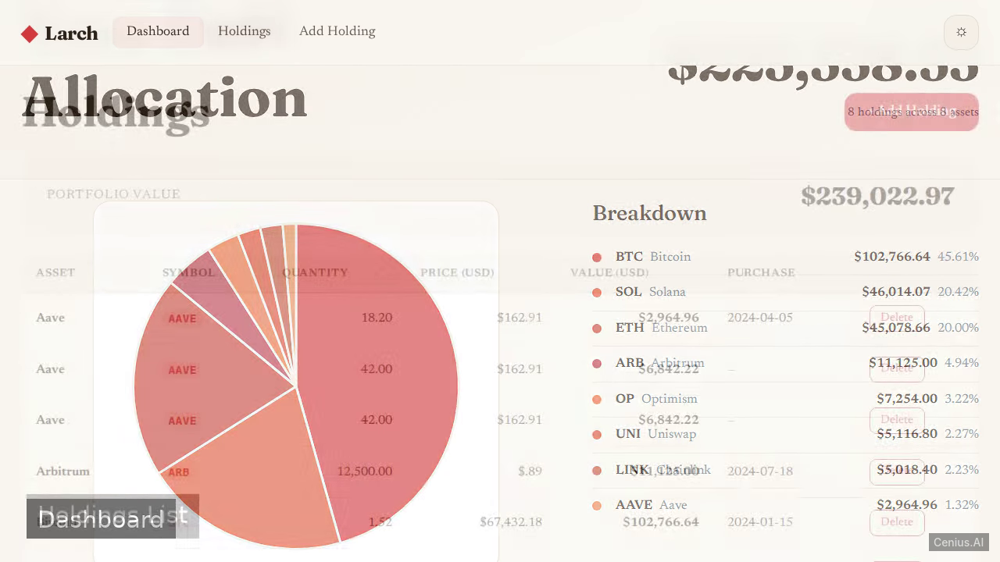
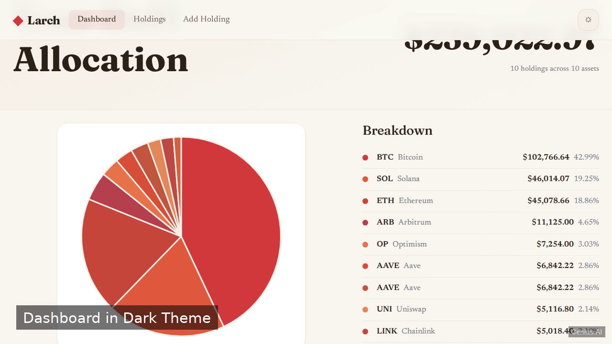

# Larch — production-ready Kotlin/Ktor personal finance tracker starter

Larch is a server-rendered DeFi crypto portfolio tracker built with Ktor and Kotlin. That's **Larch** — a Apache-2.0-licensed, open-source personal finance tracker in Kotlin/Ktor you can self-host and modify freely. Fork Larch, run it, or [remix it on cenius.ai](https://cenius.ai/marketplace/p/larch?ref=gh&utm_campaign=larch-kotlin) for a custom Larch build with full rebrand rights.


[](LICENSE)  [](https://cenius.ai)

[](https://cenius.ai/marketplace/p/larch?ref=gh&utm_campaign=larch-kotlin)

> **▶ [Open & edit in cenius.ai](https://cenius.ai/marketplace/p/larch?ref=gh&utm_campaign=larch-kotlin)** — one click to an editable workspace: describe changes in plain English, get an instant preview, one-click deploy and host. Modifications made on the platform come with full rebrand & relicense rights.

_Local clone? See [Quick start](#quick-start) below. cenius.ai is the zero-setup path._

## Demo



▶ **[Full demo walkthrough](https://cenius.ai/marketplace/p/larch?ref=gh&utm_campaign=larch-kotlin)** — watch it on the project page · [download MP4](.github/media/demo.mp4)

## Screenshots

  

## Quick start

```bash
./install.sh   # installs dependencies + seeds demo data
```

See [`INSTALL.md`](INSTALL.md) for full setup and usage instructions.

## Architecture

The setup script (`install.sh`) installs runtime dependencies and loads a starter dataset so the app is immediately usable. The Kotlin/Ktor codebase (47 files) is self-contained — no external services needed to evaluate it. Top-level layout: `gradle/`, `src/`. For environment-specific setup, see [`INSTALL.md`](INSTALL.md).

## Features

- Portfolio allocation pie chart
- Holdings list
- Add new holding
- Remove holding
- Light/dark theme toggle
- Responsive design
- Seeded demo data
- Multi‑page navigation

## Usage guide

Once the application is running (via `./gradlew run`), open a browser and navigate to [http://localhost:8080](http://localhost:8080) (or the custom port you set).

### Dashboard

The landing page shows a summary of your total portfolio value and an allocation pie chart. This data is seeded with demo holdings.

### Holdings

Lists all current holdings with their name, amount, and value. Each holding includes a delete button to remove it from the portfolio.

### Add Holding

Navigate to the "Add Holding" page to fill a form with the asset name, amount, and current value. Submitting the form adds the new holding to the portfolio and to the database.

### Theme Toggle

Use the theme toggle button (visible in the navigation) to switch between light and dark modes. Your preference persists across pages.

### Navigation

The layout provides links to all pages:
- Dashboard (`/`)
- Holdings
- Add Holding

All actions happen via standard web forms and links; no special command-line interaction is required.

_Full guide: [`USAGE.md`](USAGE.md)_

## FAQ

### How do I run Larch on my own server?

It runs entirely on your own machine. Clone, run `./install.sh`, and follow [`INSTALL.md`](INSTALL.md) — the whole stack is in this repo, no external dependencies required.

### Is white-labeling Larch allowed?

Yes. The MIT license lets you remove the original branding and ship under your own name. For a guided approach, [remix it on cenius.ai](https://cenius.ai/marketplace/p/larch?ref=gh&utm_campaign=larch-kotlin): you get a fresh build with full rebrand and relicense rights.

### What powers Larch under the hood?

Powered by Kotlin/Ktor. This repo is the real thing — full source, seed data, and all — ready to clone and start up. Highlights include responsive design.

### How can I customize Larch without editing code?

Describe what you want changed on [cenius.ai](https://cenius.ai/marketplace/p/larch?ref=gh&utm_campaign=larch-kotlin) — no code editing needed; the platform produces a fresh build you can download and deploy.

### Can I use Larch in a commercial project?

Yes — it ships under the Apache-2.0 license, which permits commercial use, modification and redistribution. The full text is in [LICENSE](LICENSE).

## License & rebranding

Released under the [Apache License 2.0](LICENSE) (© 2026 Cenius AI) — free for personal and commercial use. The Cenius name/logo are trademarks (see NOTICE).

**Need a customized version?** [Remix this app on cenius.ai](https://cenius.ai/marketplace/p/larch?ref=gh&utm_campaign=larch-kotlin) — modifications made on the platform come with **full rebrand & relicense rights** over your derivative.

## Built with cenius.ai

This entire application — code, design, seeded demo data — was generated on **[cenius.ai](https://cenius.ai)** from a plain-English description.

- 🚀 [Build your own app on cenius.ai](https://cenius.ai)
- 🎛️ [Remix Larch on the marketplace](https://cenius.ai/marketplace/p/larch?ref=gh&utm_campaign=larch-kotlin) — open it in a workspace, prompt for changes, and ship your own version.

More open-source apps: [the Cenius-ai catalog](https://github.com/Cenius-ai) · [showcase index](https://github.com/Cenius-ai/showcase)
